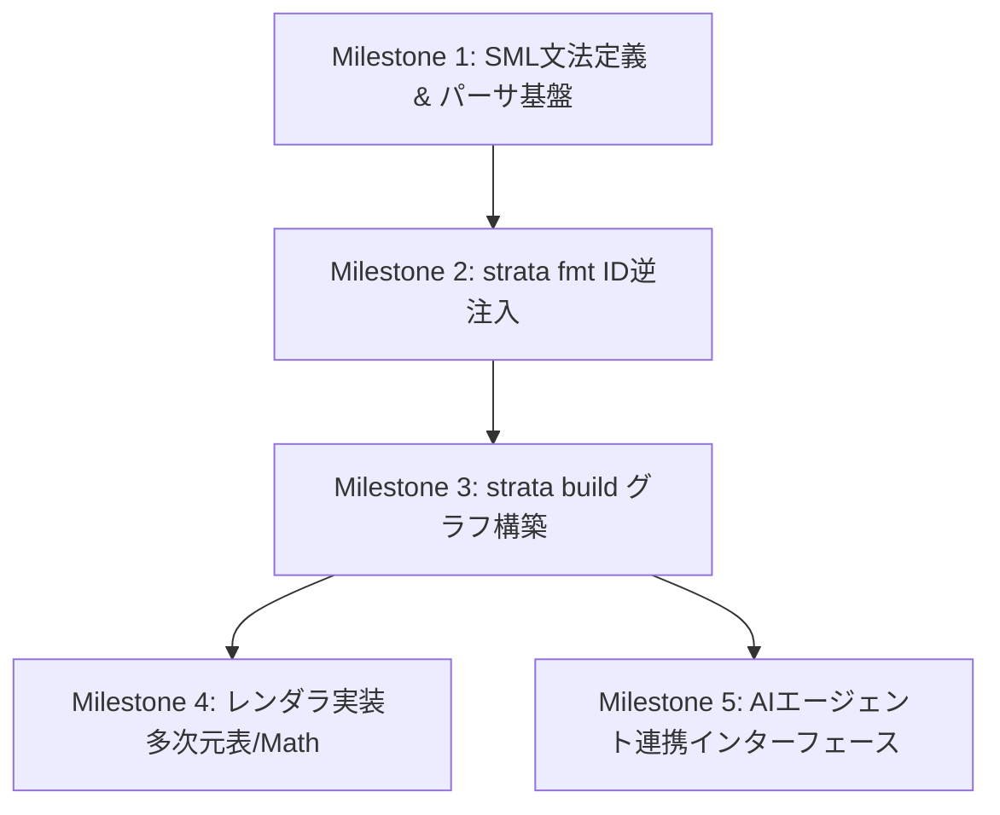

# Strata 今後の開発計画 (Plans.md)

本ドキュメントは、仕様書 `docs/strata-spec.md` に定義された仕様に基づき、Strata および SML (Strata Markup Language) の具現化に向けた実装フェーズの進め方を定義します。

---

## 1. 開発の全体像とマイルストーン

実装は以下の5つのマイルストーンに分けて進めます。

### Milestone 1: SML 文法の策定とパーサ基盤の構築
*   **目標**: SMLのテキスト表現をパースし、メモリ上の「中間抽象構文木 (SML-AST)」を構築できること。
*   **タスク**:
    *   SML（Markdown + ブロック属性 + 多次元表アノテーション）の文法（EBNF）の策定。
    *   Rust でのパーサ実装技術の選定（`pulldown-cmark` によるMarkdownパースの拡張、または `nom`/`pest` を用いたカスタムパーサの構築）。
    *   `sml-parser` クレートの新規作成。
*   **成果物**: `sml_example_draft.sml` をパースしてエラーなく AST を出力できるテストコード。

### Milestone 2: フォーマッタ (`strata fmt`) のプロトタイプ開発
*   **目標**: IDのないドラフトSMLにULIDを自動発行し、ソーステキストファイルをインプレースで書き換えること。
*   **タスク**:
    *   ASTから、IDアノテーション（`{#ULID}` や `[id=ULID]`）を持たないブロックを特定するロジックの実装。
    *   `ulid` クレートを用いた新規IDの発行。
    *   エイリアスリンク（例: `[予測精度](term)` や `[売上](cell:revenue-table#...)`）を、自動発行した実体IDに変換・書き換える解決エンジン。
    *   ソーステキストの安全なインプレース書き込み処理（パース前のコメントやフォーマットを極力壊さずにIDだけを挿入する仕組み）。
*   **成果物**: コマンド `strata fmt <file.sml>` の実装。`sml_example_draft.sml` を `sml_example_formatted.sml` の状態へ自動変換できること。

### Milestone 3: コンパイラ (`strata build`) の開発と `strata-core` 結線
*   **目標**: フォーマット済みのSMLから、`strata-core` の `Graph`（Node と Edge）を構築し、不変条件のバリデーションを通過すること。
*   **タスク**:
    *   `strata-core`（`crates/strata-core`）の `NodePayload` (Table, Math, Para 等) へのマッピング処理。
    *   SMLのネスト構造から `contains` エッジを抽出。
    *   インラインおよびブロックのアノテーション（`supports`, `depends-on`, `defines`, `ref`）から、意味的エッジを抽出し、`edges` リストに非正規化してマテリアライズ（格納）。
    *   `strata-core::invariants::validate` を結合した健全性テストの実行。
*   **成果物**: コマンド `strata build <file.sml>` の実装。

### Milestone 4: 多次元表・数式のレンダラ（層3）の構築
*   **目標**: コンパイルされた `Graph` から、人間が読める形式（HTML / Typst）への変換を実証すること。
*   **タスク**:
    *   **多次元表レンダラ**: 次元の木（`DimTree`）の深さと葉（Leaf）の数から、HTML の `colspan` および `rowspan` を自動計算してテーブルを構築するアルゴリズムの実装。
    *   **数式レンダラ**: `MathNode`（MathML Presentation サブセット）から、ブラウザで綺麗に表示できる MathML 文字列、または LaTeX / Typst 形式への変換器の実装。
*   **成果物**: コマンド `strata render <view-id>` による HTML / PDF 出力。

### Milestone 5: AIエージェント連携インターフェース (AI-native View)
*   **目標**: AIエージェントが、ユーザーの指示に基づいてSMLファイルを直接書き換えたり、グラフから必要な意味情報を高速にRAG（検索）できる仕組みの提供。
*   **タスク**:
    *   AI専用のコンテキスト抽出ビュー（Markdown Prose ＋ 意味エッジのみを凝縮した表現）の設計。
    *   AIが新しいブロックを追記する際に、自動で関係性（Edge）をアノテーションするためのプロンプト指示・テンプレート機能。

---

## 2. 実装における技術的検討事項 (Technical Considerations)

### 2.1 パーサの設計：Markdownパーサを拡張するか、カスタムか？
SML は基本 Markdown の上に構築されるため、完全なカスタムパーサを一から書くのは車輪の再発明になります。
*   **アプローチ1（推奨）**:
    Rustの標準的Markdownパーサである `pulldown-cmark` をラッパーし、段落や見出しのパース前後で `[id=...]` などのブロックアノテーションをプリプロセス、またはカスタムイベントとしてフックする。
*   **アプローチ2**:
    `pest`（PEGパーサジェネレータ）を用いて、SML専用の文法を完全に定義し直す。
    *メリット*: 多次元表の `@rows`, `@cols`, `@cells` やブロックのパーシングが非常に厳密かつ容易に書ける。

### 2.2 フォーマッタ（ID書き戻し）の安全性
ソースファイルをインプレースで書き換える（IDをインジェクションする）際、人間が書いた任意のコメントや、SMLパーサが解釈しないフォーマット（インデント等）が消失しないようにする必要があります。
*   **対策**: 抽象構文木 (AST) だけでなく、ホワイトスペースやコメントを保持する「具象構文木 (CST - Concrete Syntax Tree)」に近い形でテキストを保持し、IDの挿入箇所だけをピンポイントで書き換えるパーサ設計（`rowan` クレートなどの検討）が望ましい。

---

## 3. 次の具体的な作業 (Next Action)

まずは **Milestone 1** に向けた準備として、以下のタスクを提案します。

1.  `crates/strata-parser` クレートを Cargo ワークスペースに作成する。
2.  SMLのEBNF定義（特に `::table` ブロックと属性リスト `[...]`）を確定し、パーサのプロトタイプを Rust で作成する。
